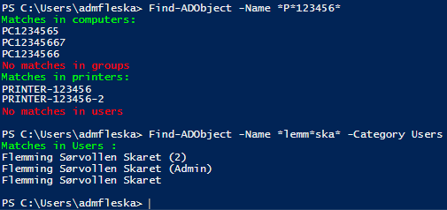

# Find-ADObject
A PowerShell function to search Active Directory for objects like Printers, Users, Groups and Computers. Supports wildcards as *

**Description**  
   A function to search Active Directory for objects.
   Category (Users, Computers, Groups and Printers) can be specified, or you can search all categories at the same time.
   It also supports wildcard so you don't have to know more then some of the text you are looking for.
   
   A lot of the search-specific code are copyed from the Microsoft Scripting Blog.
   https://devblogs.microsoft.com/scripting/
   
**Requirements**
* Windows PowerShell (tested on v5)
* Active Directory Service Interfaces

  https://docs.microsoft.com/en-us/windows/win32/adsi/active-directory-service-interfaces-adsi
  
**Instructions**

Load function:
```powershell
Import-Module .\Find-ADObject.ps1
```

Run function:
```powershell
Find-ADObject -Name *SearchText*
```

Run function and specify category:

```powershell
Find-ADObject -Name *SearchText* -Category Users
```
Category can be "Users", "Computers", "Groups" or "Printers"

**Screenshots**  



**Changelog**  
* 18.06.2020
    * Release
